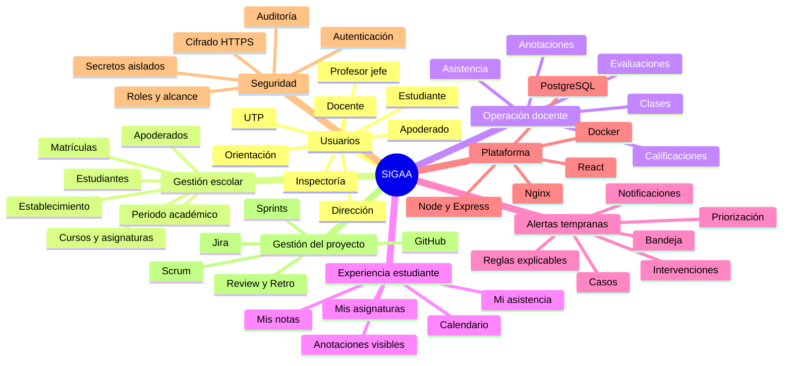

# Mapa mental de SIGAA

El mapa diferencia el problema escolar, las capacidades de producto, la
plataforma técnica y la forma de gestión. No representa una aplicación
universitaria: el dominio objetivo son liceos y colegios.
