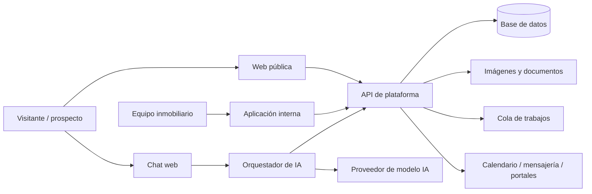
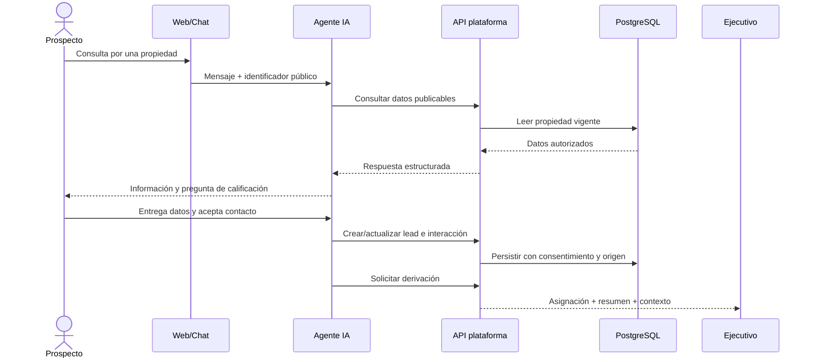

# Arquitectura de referencia

## 1. Estado de esta arquitectura

Es una hipótesis técnica para orientar refinamiento y estimaciones. La selección de lenguaje, framework, proveedor y productos externos requiere una decisión registrada mediante ADR.

## 2. Enfoque recomendado para el MVP

Comenzar con un **monolito modular** para el núcleo de negocio, acompañado por procesos asíncronos y un servicio aislado para la orquestación de IA. Reduce complejidad operativa sin mezclar responsabilidades. Los límites modulares permiten extraer servicios cuando exista una razón medible.

## 3. Vista de contexto

## 4. Contenedores lógicos

| Componente | Responsabilidad | Datos que controla |
|---|---|---|
| Web pública | Catálogo, ficha, SEO, formularios y chat | Solo contenido publicable |
| Aplicación interna | Propiedades, CRM, configuración y reportes | Datos autorizados por rol |
| API de plataforma | Reglas de negocio, permisos, auditoría e integraciones | Fuente transaccional |
| Worker | Tareas asíncronas, notificaciones, imágenes y sincronización | Eventos y trabajos |
| Orquestador IA | Política conversacional, herramientas, contexto y derivación | Sesión y trazas controladas |
| PostgreSQL | Datos transaccionales y relaciones | Propiedades, CRM y auditoría |
| Redis/cola | Caché, rate limits, sesiones efímeras y trabajos | Datos temporales |
| Object storage | Fotografías y archivos | Objetos con metadatos y permisos |
| Observabilidad | Logs, métricas, alertas y trazas | Telemetría sin secretos |

## 5. Límites del dominio

- **Identidad y acceso:** usuarios, roles, permisos y sesiones.
- **Inventario inmobiliario:** propiedades, unidades, atributos, medios, estados y publicación.
- **CRM:** contactos, leads, oportunidades, actividades, asignación y embudo.
- **Publicación:** proyección pública, búsqueda, SEO y caché.
- **Conversaciones:** canales, sesiones, mensajes, consentimiento y derivación.
- **Integraciones:** adaptadores, webhooks, reintentos e idempotencia.
- **Analítica y auditoría:** eventos, indicadores e historial inmutable de acciones críticas.

## 6. Flujo principal

## 7. Topología inicial en VPS

- Proxy inverso y terminación TLS.
- Contenedores separados para web, API, worker y orquestador IA.
- Base de datos con volumen cifrado y acceso solo por red privada.
- Redis/cola no expuesto a Internet.
- Firewall con puertos mínimos; administración por canal seguro y llaves.
- Secretos inyectados desde un almacén o mecanismo del despliegue, nunca en Git.
- Backups cifrados enviados fuera del VPS.
- Ambientes de desarrollo, staging y producción separados al menos por configuración, credenciales y datos.

Un solo VPS constituye un punto único de falla. Es aceptable únicamente para un piloto cuyo riesgo haya sido aprobado. El diseño debe permitir migrar base de datos, almacenamiento y servicios críticos a opciones administradas o redundantes.

## 8. Contratos e integración

- API versionada y documentada con OpenAPI.
- Identificadores opacos; no exponer IDs secuenciales cuando impliquen enumeración.
- Webhooks firmados, con marca temporal y protección contra repetición.
- Operaciones de integración idempotentes.
- Cola de errores para trabajos que agotaron reintentos.
- Eventos de dominio para desacoplar publicación, CRM, notificaciones y analítica.

## 9. Decisiones que requieren ADR

1. stack de frontend, backend y orquestador IA;
2. CRM propio frente a integración de un producto existente;
3. proveedor y región de infraestructura;
4. proveedor de modelo y tratamiento de datos;
5. estrategia de identidad y MFA;
6. almacenamiento y procesamiento de imágenes;
7. canal de mensajería inicial;
8. enfoque de tenancy si se comercializa para varias inmobiliarias.
