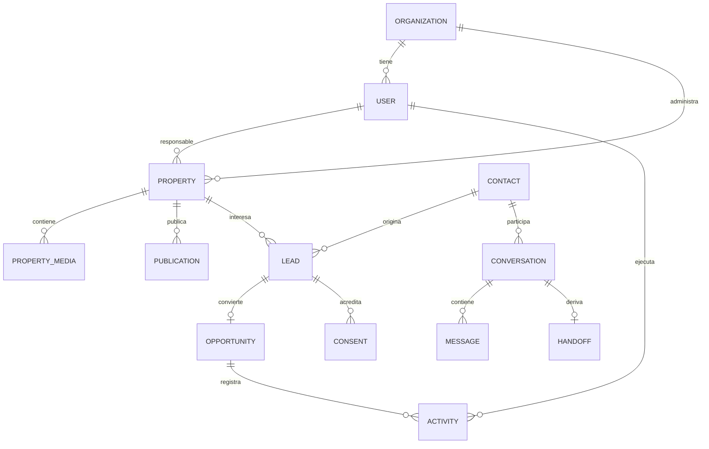

# Dominio y datos

## 1. Fuente de verdad

El núcleo transaccional debe mantener la versión autorizada de propiedades, contactos y oportunidades. La web y el agente consumen vistas explícitas de publicación; nunca consultan tablas internas sin reglas de autorización.

## 2. Modelo conceptual inicial

## 3. Entidades clave

| Entidad | Propósito | Campos esenciales iniciales |
|---|---|---|
| Organization | Límite de propiedad y configuración | id, nombre, zona horaria, estado |
| User | Identidad operativa | id, organization_id, email, estado |
| Role/Permission | Autorización | rol, permiso, alcance |
| Property | Activo inmobiliario | código, operación, tipo, ubicación, precio, estado, responsable, versión |
| PropertyMedia | Fotografías y documentos | property_id, tipo, URL/clave, orden, visibilidad |
| Publication | Proyección por canal | property_id, canal, slug, estado, fecha_publicación |
| Contact | Persona o empresa | nombre, datos de contacto, preferencias, estado |
| Lead | Consulta calificada | contact_id, property_id opcional, origen, estado, responsable |
| Opportunity | Negociación en embudo | etapa, valor estimado, probabilidad, cierre esperado |
| Activity | Seguimiento | tipo, fecha, resultado, responsable, relación |
| Conversation | Sesión por canal | contact_id opcional, canal, estado, responsable |
| Message | Interacción | conversación, emisor, contenido/ubicación segura, fecha |
| Consent | Evidencia de autorización | finalidad, texto/versión, canal, fecha, revocación |
| AuditEvent | Trazabilidad | actor, acción, recurso, fecha, correlación, metadatos seguros |

## 4. Reglas de negocio iniciales

1. Solo una propiedad válida y en estado publicable puede aparecer en canales públicos.
2. Cambiar precio, disponibilidad o estado debe invalidar caché y actualizar la proyección pública.
3. Retirar o cerrar una propiedad impide que el agente la ofrezca como disponible.
4. Un contacto puede tener varios leads, pero la deduplicación debe advertir coincidencias por datos normalizados.
5. Toda oportunidad posee responsable y etapa; cada cambio de etapa registra autor y fecha.
6. El consentimiento se almacena con finalidad y versión del texto presentado.
7. El borrado lógico conserva relaciones necesarias; la eliminación o anonimización sigue la política aprobada.
8. El agente solo accede a campos incluidos en contratos de herramienta explícitos.

## 5. Calidad y gobierno de datos

- Catálogos controlados para tipo, operación, moneda, estado, características y origen.
- Validación de formatos, rangos y combinaciones antes de publicar.
- Dirección exacta separada de la ubicación pública para evitar exposición accidental.
- Moneda y unidades almacenadas explícitamente; nunca inferidas desde texto.
- Fechas en UTC y presentación en la zona horaria de la organización.
- Índices definidos a partir de búsquedas y mediciones reales.
- Migraciones de esquema versionadas, revisadas y reversibles cuando sea viable.
- Datos de prueba sintéticos; producción no se copia a desarrollo sin anonimización aprobada.

## 6. Clasificación inicial

| Clase | Ejemplos | Controles mínimos |
|---|---|---|
| Pública | Descripción, precio publicado, comuna/zona, fotografías aprobadas | Integridad y control de publicación |
| Interna | Notas operativas, métricas, asignación | Autenticación y permisos |
| Confidencial | Email, teléfono, dirección exacta, conversaciones | Cifrado, acceso por necesidad y auditoría |
| Secreta | Contraseñas, tokens, claves API | Hash o almacén de secretos; nunca logs ni repositorio |

## 7. Retención y ciclo de vida

El Product Owner y el responsable legal deben aprobar una matriz por tipo de dato: finalidad, base de tratamiento, plazo, método de eliminación, excepciones y responsable. Hasta entonces no se deben prometer plazos de retención ni automatizar eliminaciones irreversibles.
