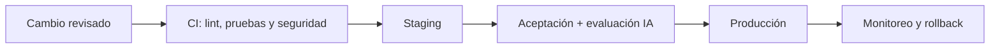

# Seguridad, operación y calidad

## 1. Modelo de seguridad inicial

### Controles preventivos

- Control de acceso por rol y organización, denegado por defecto.
- MFA para cuentas privilegiadas y protección contra fuerza bruta.
- TLS en tránsito; cifrado de discos, respaldos y objetos confidenciales.
- Secretos administrados fuera del repositorio y rotados.
- Validación de entrada, consultas parametrizadas, protección CSRF y política de contenido.
- URLs firmadas y de corta duración para objetos privados.
- Dependencias escaneadas y actualizadas mediante proceso controlado.
- Segmentación de red: base de datos, cola y paneles no expuestos públicamente.

### Controles detectivos

- Auditoría de autenticación, permisos, exportaciones y cambios críticos.
- Alertas por errores, saturación, fallas de respaldo y patrones anómalos.
- Correlación de solicitud entre web, API, worker, IA e integraciones.
- Revisión periódica de accesos y cuentas inactivas.

## 2. Amenazas prioritarias

| Amenaza | Mitigación principal |
|---|---|
| Enumeración o acceso a propiedades privadas | IDs opacos, autorización en servidor y vistas publicables |
| Acceso cruzado entre organizaciones | Filtro obligatorio de tenancy y pruebas negativas automatizadas |
| Robo de cuenta | MFA, sesiones seguras, rate limit y alertas |
| Inyección en aplicación o integraciones | Validación, parametrización, encoding y contratos estrictos |
| Prompt injection o abuso de herramientas | Instrucciones aisladas, allowlist de herramientas y autorización en API |
| Exfiltración por logs o prompts | Redacción, minimización y controles del proveedor |
| Pérdida del VPS | Backups externos, IaC y restauración ensayada |
| Webhook falsificado o repetido | Firma, timestamp, nonce/idempotencia y límites |

## 3. Ambientes y entrega

- Infraestructura y configuración reproducibles.
- Migraciones aplicadas con respaldo y verificación.
- Artefactos inmutables promovidos entre ambientes.
- Despliegue con health checks y estrategia de rollback.
- Datos y credenciales separados por ambiente.
- Aprobación explícita para producción durante el piloto.

## 4. Estrategia de pruebas

| Nivel | Cobertura esperada |
|---|---|
| Unitaria | Reglas de publicación, CRM, permisos y normalización |
| Integración | Base de datos, almacenamiento, colas y adaptadores |
| Contrato | API, webhooks y herramientas del agente |
| E2E | Publicación, consulta, lead, derivación y seguimiento |
| Seguridad | Autorización negativa, aislamiento, entrada maliciosa y dependencias |
| Rendimiento | búsqueda pública, ficha, registro de lead y concurrencia prevista |
| IA | exactitud, seguridad, herramientas, derivación y regresión |
| Recuperación | restauración de base de datos, objetos y configuración |

## 5. SLO y operación inicial

Los valores definitivos dependen del presupuesto y criticidad. Como punto de refinamiento:

- Disponibilidad objetivo del MVP: 99,5% mensual.
- Alertas basadas en impacto: indisponibilidad, error sostenido, cola detenida, almacenamiento crítico y backup fallido.
- RPO/RTO inicial: 24 h / 4 h, sujeto a aprobación.
- Runbooks para caída del sitio, base de datos, proveedor IA, canal y despliegue defectuoso.
- Guardias y escalamiento definidos antes de aceptar usuarios reales.

## 6. Evidencia de calidad por incremento

- Enlace entre historia, código, pruebas y resultado de CI.
- Evidencia de criterios de aceptación.
- Cambios de datos y API documentados.
- Riesgos y deuda técnica visibles en el backlog.
- Métricas y alertas actualizadas cuando cambia un flujo crítico.
- Manual operativo y de usuario actualizado en el mismo incremento.

## 7. Documentos de ingeniería a mantener

- Especificación OpenAPI y catálogo de eventos.
- Diccionario de datos y migraciones.
- ADR para decisiones significativas.
- Diagramas C4 y flujos críticos.
- Modelo de amenazas y matriz de permisos.
- Planes de prueba y evaluación IA.
- Runbooks, recuperación y registro de incidentes.
- Notas de release y matriz de trazabilidad.
