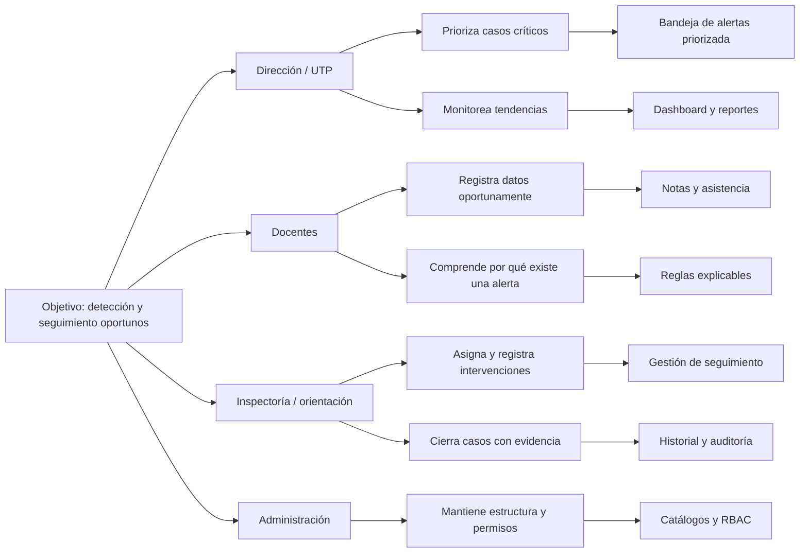

# Actores e Impact Mapping

Estado: borrador; requiere validación con una contraparte educativa.

## Mapa de actores

| Actor | Influencia | Interés | Participación esperada | Riesgo si no participa |
|---|---|---|---|---|
| Dirección/UTP | Alta | Alta | Prioriza indicadores y valida utilidad | Producto sin valor de gestión |
| Docentes | Media | Alta | Valida registro de notas y alertas | Flujo poco usable |
| Inspectoría/orientación | Media | Alta | Valida asistencia y seguimiento | Casos sin acciones realistas |
| Administrador | Alta | Media | Valida estructura, usuarios y permisos | Configuración inconsistente |
| Estudiantes | Baja | Alta | Beneficiarios; retroalimentación indirecta | Intervenciones desconectadas |
| Docente Capstone | Alta | Alta | Retroalimenta alcance y evidencias | Incumplimiento académico |
| Equipo de desarrollo | Alta | Alta | Diseña, implementa, prueba y documenta | Desviación de calidad/plazo |

## Impact Mapping

### Objetivo

Detectar y gestionar oportunamente estudiantes en riesgo académico mediante información centralizada y acciones trazables.

## Resultados esperados por actor

### Dirección y UTP

- Reducir el tiempo necesario para identificar casos críticos.
- Visualizar el estado de las alertas y acciones pendientes.
- Revisar indicadores agregados por periodo, curso o asignatura.

### Docentes

- Registrar o importar información con validaciones claras.
- Consultar alertas sin tener que interpretar fórmulas ocultas.
- Evitar duplicación de datos y correcciones no trazadas.

### Inspectoría y orientación

- Recibir casos priorizados.
- Registrar llamadas, entrevistas, acuerdos y resultados.
- Distinguir alertas nuevas, en seguimiento y cerradas.

## Preguntas de validación

1. ¿Qué datos se utilizan hoy para identificar riesgo académico?
2. ¿Quién decide que un caso necesita intervención?
3. ¿Qué umbrales de notas y asistencia son útiles?
4. ¿Qué acciones se registran actualmente y dónde?
5. ¿Qué información debe ocultarse según el rol?
6. ¿Qué indicadores necesita revisar dirección semanalmente?
7. ¿Qué significaría una alerta incorrecta o tardía?

## Evidencia requerida

- Minuta de entrevista o taller.
- Lista de participantes y roles.
- Cambios introducidos a la Product Vision.
- Reglas de negocio preliminares aceptadas o descartadas.
- Fecha de próxima validación.
