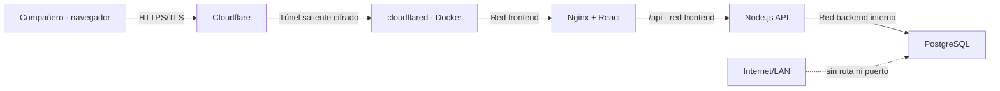

# Manual de ejecución para el equipo y servidor seguro

Estado: procedimiento operativo propuesto y configuración versionada.

Versión ilustrada para distribuir al equipo:

`../output/pdf/Manual_Instalacion_Desarrollo_y_Colaboracion_SIGAA.pdf`

## Decisión de seguridad

Los integrantes del equipo no reciben acceso al Mac servidor ni a PostgreSQL.
Existen dos formas autorizadas de uso:

1. **Desarrollo local:** cada integrante ejecuta SIGAA y una base propia con Docker.
2. **Aplicación compartida:** el integrante usa solamente la dirección HTTPS
   publicada mediante Cloudflare Tunnel.

No se comparte la IP privada `100.110.99.17`, una cuenta SSH, una clave de
Tailscale, el token del túnel ni las credenciales de PostgreSQL.

## Arquitectura protegida



- `web`, `api` y `db` no publican puertos en el servidor.
- El túnel se inicia desde dentro hacia Cloudflare; no requiere redirección de
  puertos del router.
- PostgreSQL pertenece únicamente a la red Docker `backend`, marcada `internal`.
- El contenedor del túnel pertenece únicamente a `frontend` y no puede resolver
  ni alcanzar el contenedor `db`.
- Solo la API une ambas redes.

## A. Ejecutar SIGAA en cualquier PC para desarrollar

### Requisitos

- Git.
- Docker Desktop en Windows/macOS o Docker Engine con Compose en Linux.
- 4 GB de RAM libres recomendados.

No es necesario instalar Node.js, React, Nginx ni PostgreSQL.

### Primera ejecución

```bash
git clone https://github.com/joellopez775/Captsone.git
cd Captsone
git switch fase-1-evidencias
cd SIGAA
cp .env.example .env
docker compose up --build --detach
docker compose ps
```

En Windows PowerShell, `cp` puede reemplazarse por:

```powershell
Copy-Item .env.example .env
```

Abrir <http://localhost:8088>. La API y PostgreSQL utilizados pertenecen al PC
local. Esto evita que un error de desarrollo modifique el servidor compartido.

### Accesos demo

| Perfil | Correo | Contraseña |
|---|---|---|
| Docente | `docente@sigaa.demo` | `Docente2026!` |
| Estudiante | `estudiante@sigaa.demo` | `Estudiante2026!` |

### Actualizar

```bash
git pull --ff-only
docker compose up --build --detach
docker compose ps
```

### Detener y diagnosticar

```bash
docker compose down
docker compose logs --tail=100 api web db
```

`docker compose down` conserva los datos. `docker compose down --volumes` los
elimina y solo debe usarse si se desea reiniciar la base local.

## B. Preparar el Mac servidor

Esta sección la ejecuta únicamente el propietario del servidor.

### 1. Crear secretos locales

```bash
cd ~/Services/sigaa/SIGAA
cp .env.server.example .env.server
mkdir -p .secrets
openssl rand -hex 32
```

Si ya existe la base actual, cambiar su contraseña de forma interactiva:

```bash
docker compose -f compose.yaml exec db psql -U sigaa -d sigaa -c "\password sigaa"
```

Ingresar dos veces el valor aleatorio y copiar el mismo valor en
`POSTGRES_PASSWORD` dentro de `.env.server`.
Proteger los archivos:

```bash
chmod 600 .env.server
chmod 700 .secrets
```

### 2. Crear un túnel administrado

En Cloudflare, crear un túnel permanente para producción y una ruta pública,
por ejemplo `sigaa.tudominio.cl`. El servicio de origen configurado debe ser:

```text
http://web:8080
```

Copiar solamente el token del túnel en:

```text
SIGAA/.secrets/cloudflare-tunnel-token
```

y protegerlo:

```bash
chmod 600 .secrets/cloudflare-tunnel-token
```

No usar un Quick Tunnel `trycloudflare.com` como publicación permanente.

### 2.1. Proteger obligatoriamente con Cloudflare Access

Mientras SIGAA conserve cuentas demo, el hostname no debe quedar abierto a todo
Internet. En **Zero Trust → Access controls → Applications**, crear una
aplicación `Self-hosted` para el mismo hostname y una política `Allow` que
incluya únicamente los correos exactos del equipo. No utilizar `Include Everyone`
ni permitir cualquier correo válido. La sesión recomendada para pruebas es de
8 horas.

Activar además la protección por defecto de Access para bloquear hostnames que
no tengan una aplicación y política asociada. Antes de compartir el enlace,
probarlo desde una ventana privada con un correo autorizado y otro no autorizado.

### 3. Respaldo y arranque

Antes de reemplazar una instalación existente:

```bash
mkdir -p ~/Services/sigaa-backups
docker compose -f compose.yaml exec -T db pg_dump -U sigaa -d sigaa > ~/Services/sigaa-backups/pre-server-isolation.sql
```

Después:

```bash
docker compose --env-file .env.server -f compose.server.yaml up --build --detach
docker compose --env-file .env.server -f compose.server.yaml ps
```

La configuración reutiliza por nombre el volumen existente
`sigaa_postgres_data`. En una instalación nueva Docker lo crea automáticamente.
No borrar dicho volumen; el respaldo anterior es la vía de recuperación.

### 4. Verificar aislamiento

```bash
sh scripts/verify-server-isolation.sh
docker ps --format 'table {{.Names}}\t{{.Ports}}'
```

La columna `PORTS` de `db`, `api` y `web` no debe mostrar valores del tipo
`0.0.0.0:PUERTO->PUERTO`. Desde otro equipo, los puertos `3000`, `5432` y `8088`
deben resultar inaccesibles.

## C. Entregar acceso a los compañeros

Compartir únicamente:

- URL HTTPS del portal.
- Credenciales de aplicación personales cuando exista autenticación productiva.
- URL del repositorio para desarrollo local.

Nunca compartir:

- Usuario o clave de macOS/SSH.
- Clave privada SSH o contenido de `authorized_keys`.
- Dirección Tailscale del servidor.
- `.env.server`, contraseña de PostgreSQL o token de Cloudflare.
- Acceso a Docker Desktop del servidor.

## D. Endurecimiento recomendado

- Retirar de `~/.ssh/authorized_keys` las claves que ya no necesiten acceso.
- Mantener Tailscale y SSH reservados exclusivamente al propietario.
- Activar FileVault y actualizaciones automáticas de macOS.
- Usar cuentas de aplicación individuales, contraseñas con hash y RBAC antes de
  incorporar datos reales.
- Mantener Cloudflare Access limitado a los correos exactos del equipo.
- Activar copias automáticas cifradas y probar restauración periódicamente.
- No almacenar datos reales de estudiantes mientras la autenticación continúe
  siendo de demostración.

## E. Qué protege esta configuración

El tráfico del navegador viaja por HTTPS y el túnel se establece mediante
conexiones salientes cifradas. PostgreSQL no acepta conexiones remotas: solo la
API puede alcanzarlo desde la red privada de Docker. Por esto, un compañero
puede usar SIGAA sin obtener acceso general al Mac ni consultar la base de datos
directamente.

La seguridad del portal todavía depende de reemplazar las cuentas demo y los
encabezados de rol por autenticación productiva. Hasta entonces el entorno debe
considerarse de demostración y utilizar exclusivamente datos sintéticos.
