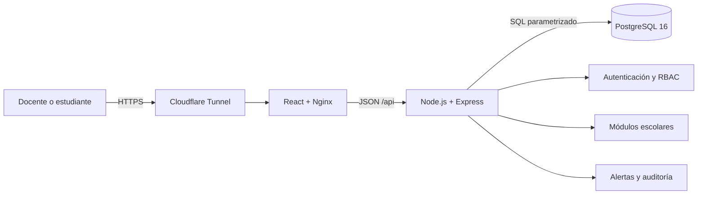

# Defensa técnica y metodológica de SIGAA

Fecha de corte: 24 de septiembre de 2026.

## Estado ejecutivo verificable

- Fase oficial: Fase 2 - Desarrollo del Proyecto APT.
- Semana oficial: 7 de 18.
- Sprint vigente por calendario: Sprint 3, del 21 de septiembre al 3 de octubre.
- Estado funcional: prototipo navegable para docente y estudiante con datos sintéticos.
- Estado de datos: esquema PostgreSQL escolar versionado hasta 0.5.0.
- Brecha principal: los flujos de negocio todavía no persisten productivamente en PostgreSQL y el inicio de sesión usa cuentas de demostración.
- Prioridad: autenticación segura, autorización por rol y persistencia de estudiantes y matrículas.

No se debe presentar el prototipo como sistema productivo terminado. La defensa correcta es que existe una vertical demostrable, una arquitectura ejecutable y un modelo de datos preparado, mientras la Fase 2 convierte esos componentes en funcionalidades persistentes y seguras.

## Arquitectura de software

SIGAA utiliza una aplicación web modular en tres contenedores:

### Responsabilidades

| Componente | Responsabilidad | Justificación |
|---|---|---|
| React | Interfaz, navegación y formularios | Separa presentación de reglas sensibles |
| Nginx | Servir la web y enrutar `/api` | Entrega un único punto de entrada |
| Express | Casos de uso, validación y autorización | Mantiene reglas de negocio fuera del navegador |
| PostgreSQL | Persistencia, relaciones e integridad | El dominio escolar es relacional y requiere trazabilidad |
| Docker Compose | Repetibilidad y aislamiento | Evita diferencias entre los equipos del grupo |
| Cloudflare Tunnel | Acceso HTTPS sin exponer la base | Publica solo la web; la red de datos permanece privada |

### Decisiones defendibles

1. Arquitectura modular antes que microservicios: tres integrantes y dieciocho semanas no justifican la complejidad operacional de muchos servicios.
2. Separación web, API y datos: permite reemplazar la interfaz sin reescribir las reglas y probar la API independientemente.
3. PostgreSQL en red interna: la base de datos no se publica hacia Internet ni hacia los compañeros.
4. Docker como contrato de ejecución: todos usan las mismas versiones y el mismo comando de inicio.
5. Evolución incremental: el motor de alertas y auditoría comienza dentro de la API y solo se separará si existen métricas que lo justifiquen.

## Arquitectura de base de datos

El modelo es relacional, normalizado y orientado a colegios y liceos. Su núcleo se organiza en cinco dominios:

1. Identidad y acceso: usuario, rol y usuario_rol.
2. Estructura escolar: establecimiento, periodo escolar, nivel, curso y asignatura.
3. Personas: funcionario, estudiante, apoderado y vínculos.
4. Operación académica: matrícula, asignación docente, evaluación, calificación, sesión y asistencia.
5. Seguimiento: anotaciones, reglas, alertas, intervenciones, comunicaciones y auditoría.

### Relaciones críticas

- Un establecimiento contiene periodos escolares.
- Un periodo contiene cursos y cada curso pertenece a un nivel.
- Un estudiante se vincula a un curso mediante matrícula, conservando su contexto anual.
- Un profesor recibe asignaciones vigentes por curso y asignatura.
- Las evaluaciones producen calificaciones por estudiante.
- Cada sesión de clase produce un registro de asistencia por estudiante.
- Las alertas conservan la regla y evidencia que explican por qué fueron generadas.

### Reglas de integridad

- UUID como identificador técnico.
- RUN, RBD, correo y códigos escolares con unicidad cuando corresponde.
- Nota entre 1,0 y 7,0 y ponderación entre 0 y 100.
- Una asistencia por estudiante y sesión.
- Una calificación por estudiante y evaluación.
- Vigencias históricas para asignaciones docentes y jefaturas.
- Una anotación se anula con trazabilidad; no se elimina silenciosamente.
- Migraciones SQL ordenadas y versión registrada en `app_metadata`.

### Estado real

Las migraciones 001 a 005 definen el esquema 0.5.0. La API comprueba conexión mediante `db-health`, pero los módulos docente y estudiante aún consumen datos sintéticos en memoria. La siguiente vertical debe reemplazar esa memoria por repositorios PostgreSQL y transacciones.

## Metodología Scrum y defensa

Se utiliza Scrum adaptado al calendario académico, con sprints quincenales y entregas Duoc como hitos externos.

### Por qué Scrum

- El alcance evoluciona al validar necesidades escolares.
- Permite mostrar un incremento cada dos semanas.
- Los riesgos de arquitectura, seguridad y datos se revisan temprano.
- El Product Owner prioriza valor y acepta o devuelve historias.
- La Review inspecciona el producto y la Retrospective mejora la forma de trabajar.

### Roles

| Rol | Responsable | Responsabilidad principal |
|---|---|---|
| Product Owner | Joel López | Priorizar, aclarar valor y aceptar el incremento |
| Scrum Master | Por ratificar | Facilitar eventos y remover impedimentos |
| Developers | Los tres integrantes | Diseñar, programar, probar y documentar |

Los tres pueden desarrollar y documentar. Los roles no crean jerarquía: delimitan decisiones y responsabilidades.

### Eventos

| Evento | Resultado esperado |
|---|---|
| Sprint Planning | Objetivo, historias y plan de trabajo |
| Daily Scrum | Avance, siguiente paso e impedimentos |
| Refinamiento | Historias entendibles, estimadas y priorizadas |
| Sprint Review | Demostración, feedback y decisión del Product Owner |
| Retrospective | Mejoras concretas para el siguiente sprint |

### Artefactos y Jira

Jira debe reflejar el trabajo, no reemplazar la evidencia técnica:

- Epic: agrupación funcional, por ejemplo Seguridad y acceso.
- Story: necesidad del usuario con criterios de aceptación.
- Task/Sub-task: trabajo técnico para completar la historia.
- Bug: comportamiento incorrecto verificable.
- Estados: Backlog, Seleccionada, En curso, En revisión, Terminada.
- Cada tarjeta debe enlazar commit, prueba, captura o documento.

Una historia solo pasa a Terminada cuando cumple la Definition of Done y queda aceptada en Review.

## Estado de sprints

| Sprint | Fechas | Resultado y situación |
|---|---|---|
| Sprint 0 | 10-22 ago | Visión, alcance, backlog, riesgos, DoD, repositorio y Docker. Informe listo; aceptación formal debe quedar firmada. |
| Sprint 1 | 24 ago-5 sep | Arquitectura, modelo ER, UML y prototipo. Incremento construido; Review y Retro requieren cierre formal del equipo. |
| Sprint 2 | 7-19 sep | Debía implementar seguridad y plataforma. El periodo terminó sin expediente formal completo; PB-011 y PB-012 se arrastran. |
| Sprint 3 | 21 sep-3 oct | Sprint vigente. Meta: primera vertical persistente y segura de estudiantes y matrículas. |

## Sprint 3 propuesto

### Sprint Goal

Permitir que un usuario autenticado opere únicamente dentro de su rol y que estudiantes y matrículas se lean y escriban realmente en PostgreSQL.

### Historias de usuario

| ID | Historia | Puntos | Estado inicial |
|---|---|---:|---|
| PB-011 | Como usuario, quiero iniciar sesión de forma segura para proteger mi información. | 8 | Arrastrada de Sprint 2 |
| PB-012 | Como establecimiento, quiero permisos por rol y alcance para impedir accesos indebidos. | 8 | Arrastrada de Sprint 2 |
| PB-015 | Como personal autorizado, quiero gestionar estudiantes para mantener registros vigentes. | 8 | Planificada Sprint 3 |
| PB-016 | Como encargado académico, quiero matricular estudiantes por curso y año para conocer su contexto escolar. | 5 | Planificada Sprint 3 |

Total comprometido propuesto: 29 puntos.

### Criterios de aceptación resumidos

- Contraseñas almacenadas con hash; nunca en texto plano.
- Sesión revocable, cookie segura o token de corta duración.
- Un estudiante no puede consultar información de otro.
- Un profesor solo opera cursos y asignaturas asignados.
- Crear y editar estudiantes persiste en PostgreSQL.
- La matrícula valida curso, periodo, duplicidad y estado.
- Casos permitidos y denegados cuentan con pruebas.
- Docker levanta web, API y base sin pasos manuales adicionales.

## Sprint Review

La Review debe demostrar, no describir:

1. Levantar el sistema desde un clon limpio con Docker.
2. Iniciar sesión como docente y estudiante.
3. Probar un acceso permitido y otro denegado.
4. Crear un estudiante y matricularlo.
5. Reiniciar la API y comprobar que los datos permanecen.
6. Mostrar pruebas y límites conocidos.
7. Registrar para cada historia: aceptada, devuelta o replanificada.

La Review pertenece al producto y la decisión final de aceptación corresponde al Product Owner.

## Sprint Retrospective

La Retro pertenece al equipo y no evalúa personas. Debe responder:

- Qué ayudó a cumplir el objetivo.
- Qué generó retrasos o defectos.
- Qué cambiaremos en el siguiente sprint.

Acciones propuestas:

1. Actualizar Jira al terminar cada sesión de trabajo.
2. Limitar el trabajo en curso a una historia por integrante.
3. No cerrar una historia sin persistencia, pruebas y evidencia.
4. Realizar integración conjunta dos veces por semana.
5. Registrar Review y Retro el mismo día del cierre.

## Guion breve de defensa

> SIGAA utiliza una arquitectura web modular de tres contenedores: React y Nginx para la interfaz, Node.js con Express para las reglas y PostgreSQL para la persistencia. Elegimos esta solución porque separa responsabilidades, es mantenible para un equipo de tres personas y se ejecuta igual en cualquier equipo mediante Docker. La base de datos representa el dominio escolar con integridad relacional y trazabilidad. Trabajamos con Scrum en sprints de dos semanas, administrando épicas e historias en Jira. Hoy estamos en Fase 2, semana 7 y Sprint 3. El prototipo ya demuestra los roles docente y estudiante, pero aún usa datos sintéticos; por eso la meta vigente es autenticación, permisos y persistencia real. En cada Review demostramos el incremento y el Product Owner decide su aceptación; en la Retrospective acordamos mejoras del proceso.

## Respuestas a preguntas probables

**¿Por qué no microservicios?** Porque aumentarían despliegues, comunicaciones y observabilidad sin aportar valor proporcional en dieciocho semanas y con tres integrantes.

**¿Por qué PostgreSQL?** Porque matrículas, cursos, notas y asistencia exigen relaciones, restricciones, transacciones e historial consistente.

**¿Por qué Scrum?** Porque permite validar incrementos y ajustar prioridades sin esperar al final del semestre.

**¿Está terminado?** No. Existe un prototipo y un diseño ejecutable; la Fase 2 debe convertirlos en una vertical persistente, segura y probada.

**¿Qué ocurre si una historia no cumple?** No se marca como terminada; vuelve al Product Backlog y el Product Owner decide su prioridad.

**¿Qué diferencia Review y Retro?** Review inspecciona el producto con interesados; Retro inspecciona la forma de trabajo del equipo.
