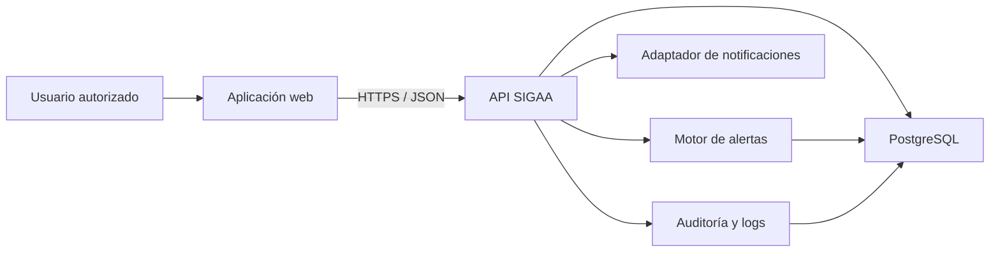
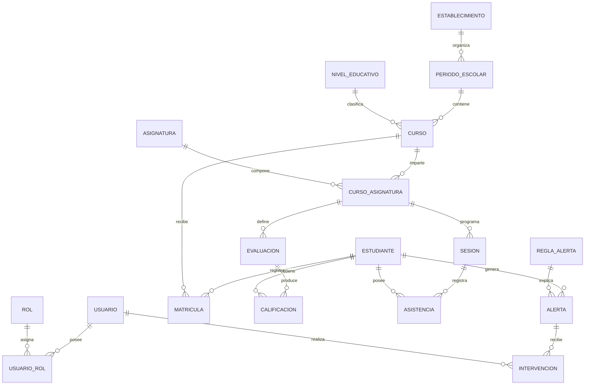
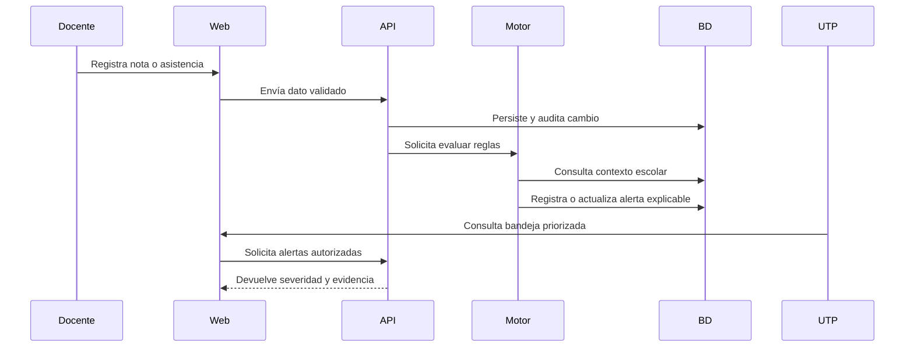

# Arquitectura preliminar — SIGAA

Estado: borrador de Sprint 1. Debe validarse mediante una prueba técnica y ADR-001.

## Objetivos arquitectónicos

- Separar reglas escolares de la interfaz y persistencia.
- Proteger datos mediante autenticación, autorización y auditoría.
- Mantener alertas explicables y verificables.
- Facilitar pruebas unitarias e integración.
- Permitir despliegue reproducible con Docker.

## Vista de contenedores

## Módulos propuestos

| Módulo | Responsabilidad |
|---|---|
| Identidad y acceso | Usuarios, autenticación, roles y permisos |
| Estructura escolar | Establecimiento, años escolares, niveles, cursos y asignaturas |
| Comunidad educativa | Estudiantes, apoderados y matrículas anuales por curso |
| Evaluación y asistencia | Evaluaciones, notas, sesiones y asistencia |
| Alertas | Reglas, ejecución, evidencia, severidad y deduplicación |
| Seguimiento | Asignación, intervenciones, estados y cierre |
| Analítica | Indicadores y reportes |
| Auditoría | Cambios sensibles, actor y marca temporal |

## Modelo de datos conceptual

## Flujo principal de alerta

## Requisitos no funcionales iniciales

- Seguridad: mínimo privilegio, contraseñas protegidas, control por rol y auditoría.
- Rendimiento: consultas principales bajo un umbral que se definirá con volumen de prueba.
- Disponibilidad: recuperación documentada y manejo de fallos controlado para la demo.
- Portabilidad: ejecución local mediante Docker Compose.
- Mantenibilidad: módulos, migraciones, pruebas y decisiones versionadas.
- Privacidad: datos sintéticos o anonimizados; no almacenar información innecesaria.

## Preguntas abiertas

- Framework backend definitivo.
- Estrategia de autenticación.
- Regla exacta de cálculo de notas y asistencia.
- Canal real o simulado de notificaciones.
- Volumen de datos y umbrales de rendimiento.
