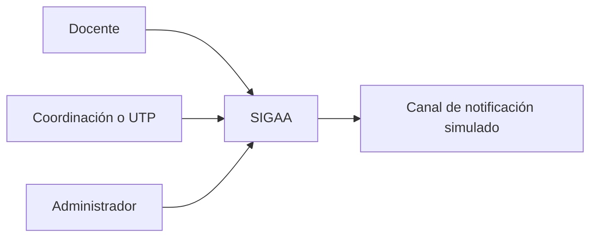
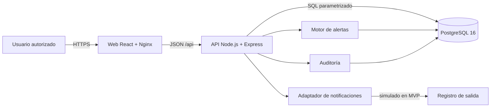

# Arquitectura de contenedores - Sprint 1

Estado: lista para revisión técnica.

## Decisión de arquitectura

SIGAA adopta una arquitectura modular en tres contenedores para el MVP: aplicación web, API y PostgreSQL. El motor de alertas, auditoría y notificaciones se implementan inicialmente como módulos internos de la API; podrán separarse si las métricas de carga o mantenibilidad lo justifican.

## Vista de contexto

## Vista de contenedores

## Responsabilidades

| Contenedor o módulo | Responsabilidad | No debe hacer |
|---|---|---|
| Web | Presentación, navegación, formularios y estado de interfaz | Ejecutar reglas de negocio sensibles |
| API | Autorización, casos de uso, validación y contratos JSON | Depender de detalles visuales |
| PostgreSQL | Integridad, relaciones, persistencia y consultas | Resolver flujos de interfaz |
| Identidad | Usuarios, sesiones, roles y permisos | Mezclar permisos con componentes visuales |
| Académico | Periodos, asignaturas, secciones, matrículas y evaluaciones | Generar alertas sin reglas versionadas |
| Alertas | Evaluar reglas, explicar evidencia, deduplicar y priorizar | Ocultar el motivo de una alerta |
| Seguimiento | Intervenciones, responsables, estados y cierre | Modificar evidencia histórica |
| Auditoría | Actor, acción, entidad, fecha y cambios relevantes | Almacenar secretos o contraseñas |

## Interfaces principales

| Método | Ruta prevista | Uso | Rol mínimo |
|---|---|---|---|
| POST | `/api/auth/login` | Iniciar sesión | Público |
| GET | `/api/dashboard` | Resumen autorizado | Docente |
| GET | `/api/estudiantes` | Buscar estudiantes | Docente |
| GET | `/api/estudiantes/:id` | Consultar ficha | Docente |
| GET | `/api/alertas` | Bandeja priorizada | Docente |
| POST | `/api/alertas/:id/intervenciones` | Registrar seguimiento | Docente |
| PATCH | `/api/alertas/:id` | Cambiar estado | Coordinación |
| POST | `/api/configuracion/reglas` | Versionar regla | Administrador |

Las rutas de prototipo pueden devolver datos sintéticos antes de implementar autenticación y persistencia productivas.

## Despliegue local

- Nginx publica la web y enruta `/api` al servicio API.
- La API y PostgreSQL permanecen en la red interna de Docker Compose.
- PostgreSQL utiliza volumen persistente y script de inicialización versionado.
- Los secretos no se versionan; `.env.example` documenta únicamente nombres y valores seguros de ejemplo.
- Cada servicio expone healthcheck antes de considerarse disponible.

## Seguridad y privacidad

- Denegar por defecto y autorizar por rol.
- Usar contraseñas con hash resistente y sesiones revocables.
- Validar entradas en la API y parametrizar consultas.
- Registrar cambios sensibles y accesos administrativos.
- Mantener datos sintéticos durante desarrollo y demostración.
- Evitar mostrar diagnósticos o información sensible en dashboards generales.

## Atributos de calidad verificables

| Atributo | Criterio inicial |
|---|---|
| Portabilidad | `docker compose up --build` inicia los tres servicios |
| Disponibilidad de demo | 3 de 3 healthchecks saludables |
| Mantenibilidad | módulos y contratos versionados; pruebas por caso de uso |
| Seguridad | RBAC, validación, auditoría y secretos externos |
| Explicabilidad | toda alerta muestra regla, umbral y evidencia |
| Rendimiento | consultas principales bajo 500 ms con datos de prueba |

## Riesgos y decisiones pendientes

- Ratificar Express frente a NestJS con todo el equipo.
- Confirmar reglas académicas y permisos con contraparte.
- Definir estrategia de sesión en PB-011.
- Medir volumen y rendimiento con dataset sintético en Fase 2.
