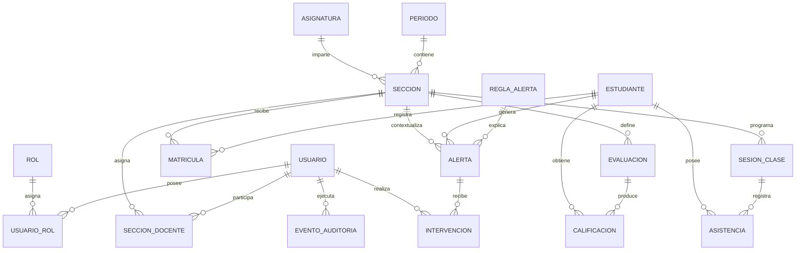

# Modelo ER y diccionario de datos - Sprint 1

Estado: diseño lógico listo para revisión; no corresponde todavía a una migración productiva.

## Modelo lógico

## Entidades principales

| Entidad | Clave y atributos esenciales | Regla de integridad |
|---|---|---|
| usuario | id UUID, email, nombre, password_hash, estado | email único; no exponer hash |
| rol | id, codigo, nombre | código único y estable |
| usuario_rol | usuario_id, rol_id, vigente_desde, vigente_hasta | combinación sin duplicados vigentes |
| periodo | id, codigo, fecha_inicio, fecha_fin, estado | inicio anterior a fin |
| asignatura | id, codigo, nombre | código único |
| seccion | id, periodo_id, asignatura_id, codigo | única por periodo, asignatura y código |
| seccion_docente | seccion_id, usuario_id | usuario debe poseer rol permitido |
| estudiante | id, identificador_interno, nombre, email_institucional | identificador único; RUT no requerido para demo |
| matricula | id, estudiante_id, seccion_id, estado | una matrícula activa por estudiante y sección |
| evaluacion | id, seccion_id, nombre, ponderacion, fecha | ponderación entre 0 y 100 |
| calificacion | id, evaluacion_id, estudiante_id, valor | valor dentro de escala configurada |
| sesion_clase | id, seccion_id, fecha, bloque | no duplicar sección, fecha y bloque |
| asistencia | sesion_id, estudiante_id, estado | un registro por sesión y estudiante |
| regla_alerta | id, codigo, version, tipo, parametros_json, activa | código y versión únicos |
| alerta | id, estudiante_id, seccion_id, regla_id, severidad, estado, evidencia_json | conservar regla y evidencia que originaron la alerta |
| intervencion | id, alerta_id, usuario_id, tipo, nota, creada_en | no eliminar; corregir mediante nueva entrada |
| evento_auditoria | id, usuario_id, accion, entidad, entidad_id, cambios_json, creada_en | inmutable y sin secretos |

## Catálogos controlados

- Estado de usuario: activo, bloqueado, inactivo.
- Estado de matrícula: activa, retirada, finalizada.
- Asistencia: presente, ausente, justificada, pendiente.
- Severidad: informativa, media, alta, crítica.
- Estado de alerta: abierta, asignada, en_seguimiento, resuelta, descartada.

## Reglas de diseño

1. Usar UUID para identificadores técnicos expuestos por API.
2. Conservar códigos institucionales como claves naturales únicas, no como claves primarias.
3. Versionar `regla_alerta`; una alerta histórica referencia la versión aplicada.
4. Guardar evidencia estructurada para explicar cada alerta sin recalcular el pasado.
5. Evitar datos personales innecesarios en ambientes de desarrollo.
6. Aplicar borrado lógico a usuarios y catálogos referenciados.
7. Registrar cambios sensibles en `evento_auditoria`.

## Índices previstos

- `usuario(email)` único.
- `estudiante(identificador_interno)` único.
- `matricula(seccion_id, estudiante_id)` único para estados activos.
- `alerta(estado, severidad, creada_en)` para la bandeja.
- `alerta(estudiante_id, seccion_id)` para historial.
- `evento_auditoria(entidad, entidad_id, creada_en)` para trazabilidad.

## Datos sintéticos mínimos

El prototipo utilizará al menos cinco estudiantes, dos secciones, cuatro alertas y tres intervenciones. Los nombres y correos serán ficticios y se rotularán como datos de demostración.

## Pendientes de validación

- Escala real de calificaciones.
- Cálculo de asistencia y tratamiento de justificaciones.
- Umbrales y responsables por severidad.
- Política de retención y acceso a observaciones.
