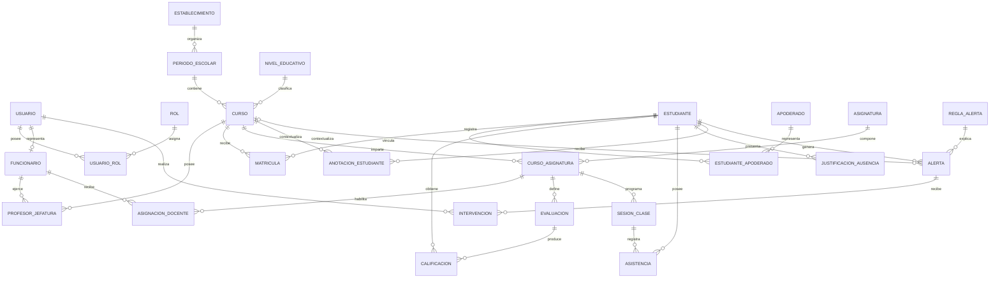

# Modelo ER y diccionario de datos escolar — Sprint 1

Estado: esquema físico escolar y modelo docente implementados en las migraciones
`003_school_domain.sql` y `004_teacher_model.sql`; pendiente conectar repositorios productivos.

Versión de esquema: `0.4.0`. Perfil: `escolar`.

## Corrección de dominio

El modelo 0.2.0 interpretó erróneamente SIGAA como una solución universitaria.
La definición confirmada por el Product Owner y los flujos operativos establece
que el producto está dirigido a colegios y liceos. La migración 0.3.0 elimina
conceptos de carrera, créditos, cohorte y matrícula por sección, y los sustituye
por establecimiento, año escolar, nivel, curso, profesor jefe y apoderado.

## Modelo lógico vigente

## Entidades principales

| Entidad | Atributos esenciales | Regla de integridad |
|---|---|---|
| establecimiento | rbd, nombre, tipo, dependencia | tipo colegio o liceo; RBD único cuando exista |
| periodo_escolar | establecimiento_id, año, fechas, estado | un año por establecimiento; inicio anterior a fin |
| nivel_educativo | código, nombre, ciclo, orden | código único; ciclo escolar controlado |
| curso | periodo_id, nivel_id, letra, profesor_jefe_id | combinación año, nivel y letra única |
| asignatura | código, nombre, estado | código único; sin créditos universitarios |
| curso_asignatura | curso_id, asignatura_id, profesor_id | una oferta por asignatura y curso |
| funcionario | usuario_id, RUN, nombres, estado | identidad laboral separada del acceso |
| asignacion_docente | curso_asignatura_id, funcionario_id, función, vigencia, capacidades | permite múltiples profesores y reemplazos |
| profesor_jefatura | curso_id, funcionario_id, vigencia | una jefatura titular vigente por curso |
| usuario / rol | email, estado / código, nombre | email y código únicos; autorización en backend |
| estudiante | RUN, identificador, nombres, apellidos, estado | identificador interno único |
| apoderado | RUN, nombres, contacto, estado | vínculo a uno o más estudiantes |
| estudiante_apoderado | estudiante_id, apoderado_id, es_principal | vínculo único; notificación configurable |
| matricula | estudiante_id, curso_id, estado | matrícula activa por estudiante y curso |
| evaluacion | curso_asignatura_id, fecha, ponderación | ponderación entre 0 y 100 |
| calificacion | evaluacion_id, estudiante_id, valor | nota entre 1,0 y 7,0; una por evaluación |
| sesion_clase | curso_asignatura_id, fecha, bloque | sesión única por bloque |
| asistencia | sesion_id, estudiante_id, estado | un registro por sesión y estudiante |
| justificacion_ausencia | estudiante_id, rango, motivo, estado | rango válido y revisión trazable |
| anotacion_estudiante | estudiante_id, curso_id, tipo, categoría, detalle, autor | positiva o negativa; anulable, no eliminable |
| regla_alerta | código, versión, tipo, parámetros | código y versión únicos |
| alerta | estudiante_id, curso_id, regla_id, evidencia | conserva la regla y evidencia original |
| intervencion | alerta_id, usuario_id, tipo, nota | no se elimina; nuevas entradas corrigen historial |
| evento_auditoria | actor, acción, entidad, valores, fecha | inmutable y sin secretos |

## Roles escolares

1. Administrador.
2. Dirección / UTP.
3. Profesor jefe.
4. Profesor de asignatura.
5. Inspectoría.
6. Estudiante.
7. Apoderado.

El profesor jefe consulta el contexto integral de su curso, pero solo modifica
información para la que posee permiso. El profesor de asignatura registra notas
y asistencia únicamente en sus asignaturas. Inspectoría administra asistencia,
atrasos y justificaciones. Estudiante y apoderado son perfiles de consulta.

## Reglas de diseño y seguridad

- UUID como identificador técnico y códigos escolares como claves naturales.
- Autorización en la API por rol y alcance; ocultar controles no reemplaza RBAC.
- Alertas explicables con regla versionada y evidencia estructurada.
- Auditoría de cambios sensibles e intervenciones no eliminables.
- Datos sintéticos durante el desarrollo; no usar datos reales sin autorización.
- Respaldo obligatorio antes de una migración de dominio.

## Estrategia de migración

La migración 003 es transaccional. Antes de modificar el esquema verifica que
no existan registros operacionales; si los encuentra, aborta con error y exige
una conversión explícita. En el estado actual se verificaron cero usuarios,
estudiantes, matrículas, calificaciones y asistencias. La secuencia completa
001 → 002 → 003 → 004 fue validada sobre una base temporal limpia.

## Datos sintéticos mínimos

El prototipo representa un liceo ficticio, dos cursos de segundo medio, cinco
estudiantes, cuatro alertas y dos intervenciones. Los nombres, identificadores,
cuentas y resultados son exclusivamente demostrativos.
