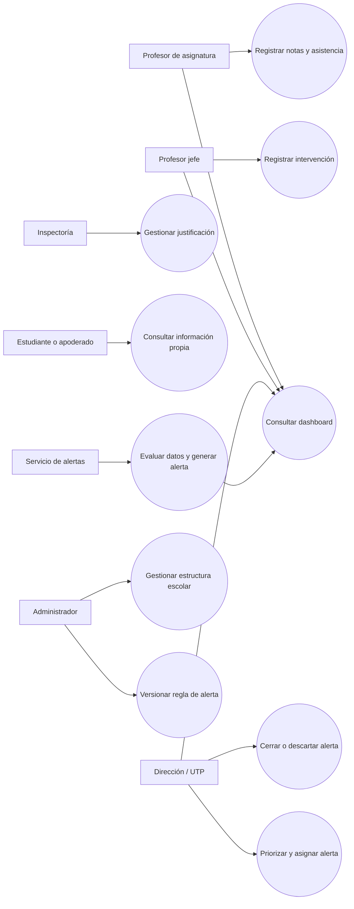
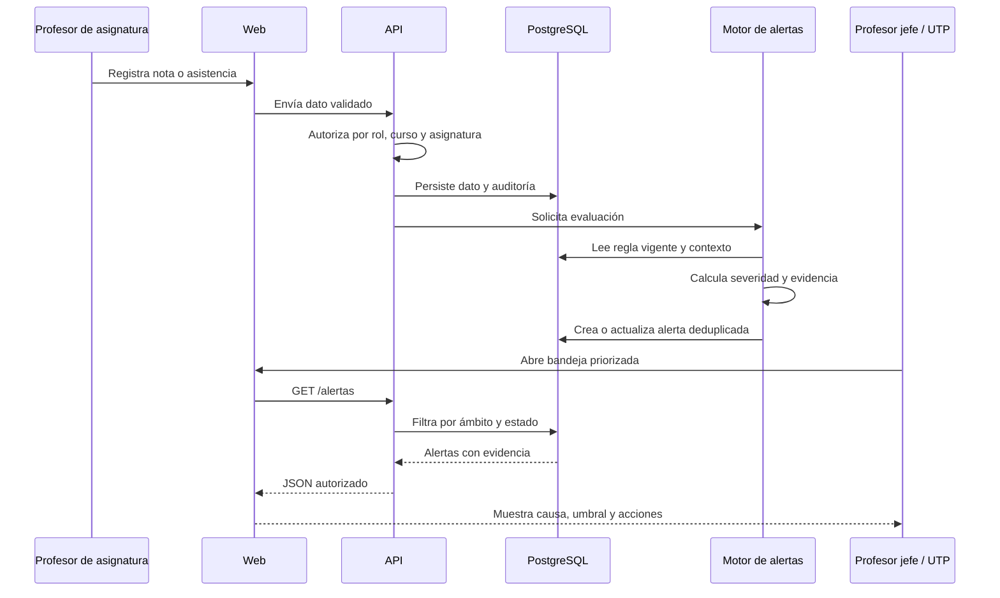
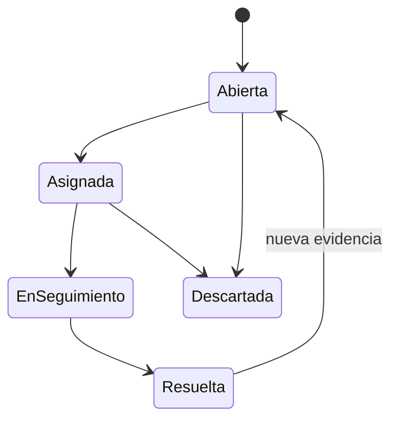

# UML y casos de uso principales - Sprint 1

Estado: listo para revisión funcional.

## Actores

- Profesor de asignatura: registra notas y asistencia en sus cursos-asignatura.
- Profesor jefe: consulta el contexto completo de su curso y registra seguimiento.
- Dirección / UTP: prioriza, asigna y supervisa seguimiento.
- Inspectoría: gestiona asistencia, atrasos y justificaciones.
- Estudiante y apoderado: consultan información propia o autorizada.
- Administrador: configura usuarios, roles, años escolares y estructura del establecimiento.
- Servicio de alertas: evalúa reglas versionadas con datos académicos.

## Casos de uso

## UC-01 Consultar dashboard

- Actor: profesor de asignatura, profesor jefe o Dirección / UTP.
- Precondición: sesión válida y ámbito autorizado.
- Flujo: seleccionar periodo; API filtra por rol; sistema muestra estudiantes, asistencia, promedio, alertas abiertas y tendencia.
- Alternativa: sin datos, mostrar estado vacío y fecha de última actualización.
- Resultado: resumen visible sin exponer información fuera del ámbito del usuario.

## UC-02 Consultar ficha de estudiante

- Actor: docente o coordinación.
- Precondición: acceso al curso o asignatura del estudiante.
- Flujo: buscar por identificador o nombre; abrir ficha; revisar matrícula, indicadores, alertas e intervenciones.
- Excepción: acceso no autorizado devuelve 403 y registra auditoría.
- Resultado: información contextual y trazable.

## UC-03 Gestionar alerta

- Actor: profesor jefe o Dirección / UTP.
- Precondición: alerta abierta y permiso de seguimiento.
- Flujo: revisar regla y evidencia; asignar responsable; registrar intervención; cambiar estado.
- Excepción: una transición inválida se rechaza sin modificar historial.
- Resultado: alerta actualizada con evento de auditoría.

## Secuencia principal de alerta

## Transiciones de alerta

## Reglas de autorización

- Profesor de asignatura: solo cursos-asignatura asignados; registra sus notas y asistencia.
- Profesor jefe: consulta todo su curso; no altera notas ajenas y gestiona seguimiento.
- Dirección / UTP: establecimiento dentro de su ámbito y capacidad de asignar/cerrar.
- Inspectoría: asistencia, atrasos y justificaciones; no modifica calificaciones.
- Estudiante y apoderado: solo lectura de información propia o vinculada.
- Administrador: configuración; no obtiene acceso irrestricto a observaciones sensibles por defecto.
- Todo cambio de estado conserva actor, fecha, estado anterior y motivo.
