# Modelo ER objetivo para colegios y liceos

Estado: arquitectura objetivo; no representa completamente el esquema físico vigente.

Versión vigente implementada: `0.3.0`.

Uso previsto: orientar la evolución de SIGAA durante los siguientes sprints.

## Propósito

Este modelo describe la base de datos completa a la que puede evolucionar
SIGAA sin convertir el producto en un ERP escolar general. El alcance se
concentra en estructura escolar, estudiantes y apoderados, matrícula, docencia,
calificaciones, asistencia, convivencia, alertas y acompañamiento.

## Diagrama objetivo

```mermaid
erDiagram
    ESTABLECIMIENTO ||--o{ SEDE : posee
    ESTABLECIMIENTO ||--o{ PERIODO_ESCOLAR : organiza
    PERIODO_ESCOLAR ||--o{ SUBPERIODO : divide
    ESTABLECIMIENTO ||--o{ NIVEL_EDUCATIVO : ofrece
    NIVEL_EDUCATIVO ||--o{ CURSO : clasifica
    PERIODO_ESCOLAR ||--o{ CURSO : contiene
    SEDE ||--o{ CURSO : ubica

    USUARIO ||--o{ USUARIO_ROL : posee
    ROL ||--o{ USUARIO_ROL : asigna
    ESTABLECIMIENTO ||--o{ USUARIO_ROL : delimita
    USUARIO ||--o| FUNCIONARIO : representa
    USUARIO ||--o| ESTUDIANTE : representa
    USUARIO ||--o| APODERADO : representa

    FUNCIONARIO ||--o{ FUNCIONARIO_CARGO : ejerce
    CARGO ||--o{ FUNCIONARIO_CARGO : define
    CURSO ||--o{ PROFESOR_JEFATURA : posee
    FUNCIONARIO ||--o{ PROFESOR_JEFATURA : lidera

    ESTUDIANTE ||--o{ ESTUDIANTE_APODERADO : vincula
    APODERADO ||--o{ ESTUDIANTE_APODERADO : representa

    ESTUDIANTE ||--o{ MATRICULA : registra
    CURSO ||--o{ MATRICULA : recibe
    PERIODO_ESCOLAR ||--o{ MATRICULA : contextualiza
    MATRICULA ||--o{ CAMBIO_MATRICULA : historiza

    PLAN_ESTUDIO ||--o{ PLAN_ASIGNATURA : contiene
    ASIGNATURA ||--o{ PLAN_ASIGNATURA : integra
    NIVEL_EDUCATIVO ||--o{ PLAN_ESTUDIO : aplica
    CURSO ||--o{ CURSO_ASIGNATURA : imparte
    ASIGNATURA ||--o{ CURSO_ASIGNATURA : define
    PLAN_ASIGNATURA ||--o{ CURSO_ASIGNATURA : planifica
    CURSO_ASIGNATURA ||--o{ ASIGNACION_DOCENTE : posee
    FUNCIONARIO ||--o{ ASIGNACION_DOCENTE : realiza

    CURSO_ASIGNATURA ||--o{ EVALUACION : programa
    SUBPERIODO ||--o{ EVALUACION : agrupa
    TIPO_EVALUACION ||--o{ EVALUACION : clasifica
    EVALUACION ||--o{ CALIFICACION : produce
    ESTUDIANTE ||--o{ CALIFICACION : obtiene
    CALIFICACION ||--o{ HISTORIAL_CALIFICACION : versiona
    EVALUACION ||--o{ RUBRICA : utiliza
    RUBRICA ||--o{ CRITERIO_RUBRICA : contiene

    CURSO_ASIGNATURA ||--o{ SESION_CLASE : programa
    FUNCIONARIO ||--o{ SESION_CLASE : registra
    SESION_CLASE ||--o{ ASISTENCIA : genera
    ESTUDIANTE ||--o{ ASISTENCIA : posee
    ESTUDIANTE ||--o{ JUSTIFICACION_AUSENCIA : presenta
    JUSTIFICACION_AUSENCIA ||--o{ DOCUMENTO_ADJUNTO : respalda
    JUSTIFICACION_AUSENCIA ||--o{ REVISION_JUSTIFICACION : revisa

    ESTUDIANTE ||--o{ ANOTACION_CONVIVENCIA : recibe
    FUNCIONARIO ||--o{ ANOTACION_CONVIVENCIA : registra
    TIPO_ANOTACION ||--o{ ANOTACION_CONVIVENCIA : clasifica

    REGLA_ALERTA ||--o{ VERSION_REGLA : versiona
    VERSION_REGLA ||--o{ ALERTA : explica
    ESTUDIANTE ||--o{ ALERTA : genera
    CURSO ||--o{ ALERTA : contextualiza
    CURSO_ASIGNATURA ||--o{ ALERTA : contextualiza
    ALERTA ||--o{ ASIGNACION_ALERTA : asigna
    FUNCIONARIO ||--o{ ASIGNACION_ALERTA : atiende
    ALERTA ||--o{ INTERVENCION : recibe
    FUNCIONARIO ||--o{ INTERVENCION : realiza
    INTERVENCION ||--o{ ACUERDO_SEGUIMIENTO : genera
    ALERTA ||--o{ CAMBIO_ESTADO_ALERTA : historiza

    ESTUDIANTE ||--o{ PLAN_ACOMPANAMIENTO : posee
    PLAN_ACOMPANAMIENTO ||--o{ OBJETIVO_ACOMPANAMIENTO : define
    PLAN_ACOMPANAMIENTO ||--o{ INTERVENCION : organiza

    USUARIO ||--o{ NOTIFICACION : recibe
    ALERTA ||--o{ NOTIFICACION : origina
    NOTIFICACION ||--o{ ENTREGA_NOTIFICACION : registra

    USUARIO ||--o{ SESION_USUARIO : inicia
    USUARIO ||--o{ EVENTO_AUDITORIA : ejecuta
```

## Dominios cubiertos

| Dominio | Entidades principales | Resultado esperado |
|---|---|---|
| Institución | establecimiento, sede, periodo, subperiodo, nivel, curso | Representar uno o más establecimientos y sus años escolares |
| Personas y acceso | usuario, rol, funcionario, cargo, estudiante, apoderado | Separar credenciales, identidad y funciones institucionales |
| Matrícula | matrícula, cambio_matrícula | Inscribir por curso y año, conservando historial |
| Docencia | plan_estudio, curso_asignatura, asignación_docente, jefatura | Gestionar titulares, reemplazos, codocencia y vigencias |
| Evaluación | evaluación, calificación, historial, rúbrica | Registrar notas y correcciones trazables |
| Asistencia | sesión, asistencia, justificación, revisión, adjunto | Mantener el registro original y resolver justificaciones |
| Convivencia | anotación, tipo_anotación | Incorporar antecedentes con acceso restringido |
| Alertas | regla, versión, alerta, asignación, cambio_estado | Explicar cada alerta y conservar su ciclo de vida |
| Acompañamiento | plan, objetivo, intervención, acuerdo | Coordinar acciones con responsables y fechas |
| Plataforma | notificación, entrega, sesión, auditoría | Seguridad, trazabilidad y evidencia operacional |

## Reglas estructurales relevantes

1. La matrícula relaciona estudiante, curso y periodo escolar; no se crea una
   matrícula independiente para cada asignatura.
2. La jefatura y las asignaciones docentes tienen vigencia histórica para
   soportar reemplazos y cambios durante el año.
3. Una calificación corregida conserva valor anterior, valor nuevo, autor,
   motivo, fecha y versión.
4. Una justificación no elimina la ausencia original; registra su revisión y
   resolución como información relacionada.
5. Cada alerta referencia la versión exacta de la regla y conserva la evidencia
   utilizada al generarla.
6. Estudiante y apoderado poseen acceso de lectura solo a información propia o
   expresamente vinculada.
7. Las acciones sensibles producen eventos de auditoría inmutables.

## Evolución desde el esquema 0.3.0

El esquema actual ya implementa el núcleo escolar. Para aproximarse al modelo
objetivo se propone incorporar, en este orden:

1. Funcionarios, cargos, jefaturas y asignaciones docentes históricas.
2. Subperiodos, planes de estudio e historial de matrículas.
3. Historial de calificaciones y rúbricas.
4. Revisión documental de justificaciones.
5. Historial de responsables y estados de alertas.
6. Planes formales de acompañamiento.
7. Convivencia escolar con permisos reforzados.
8. Notificaciones, sesiones y controles operacionales de seguridad.

## Límite de implementación

Este documento define el destino arquitectónico, no autoriza implementar todas
las entidades simultáneamente. Cada ampliación debe incorporarse mediante una
historia priorizada, una migración versionada y criterios de aceptación. El
próximo incremento funcional debe concentrarse en autenticación, RBAC y conexión
de matrícula, notas, asistencia y alertas con PostgreSQL.
