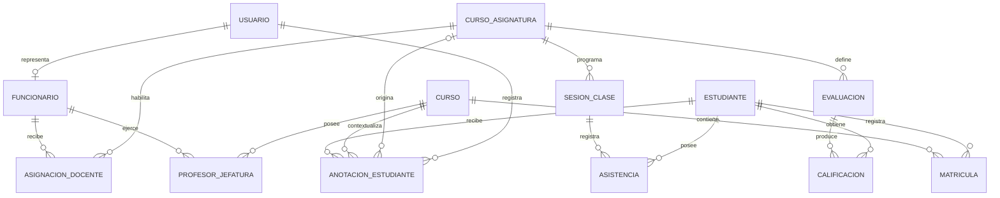

# Modelo funcional del profesor

Estado: incremento funcional implementado con datos sintéticos.

Historia: PB-038.

Esquema físico: `0.4.0`.

## Objetivo

Permitir que un profesor gestione uno o varios cursos y asignaturas dentro de
un ámbito explícitamente asignado. El módulo cubre planificación de clases,
asistencia, evaluaciones, calificaciones y anotaciones positivas o negativas.

## Principio de autorización

La unidad de permiso es la asignación docente:

```text
Profesor + Curso + Asignatura + Vigencia + Capacidades
```

Ser profesor jefe amplía la consulta y el acompañamiento de su curso, pero no
autoriza modificar notas o asistencia pertenecientes a otros profesores.

## Modelo de datos



## Capacidades

| Capacidad | Alcance | Regla |
|---|---|---|
| Consultar cursos | Asignaciones vigentes | No mostrar cursos ajenos |
| Planificar clase | Curso-asignatura con `puede_planificar` | Exigir fecha, título y objetivo |
| Pasar asistencia | Estudiantes matriculados y asignación autorizada | Un estado por estudiante y sesión |
| Crear evaluación | Curso-asignatura con `puede_calificar` | Ponderación entre 1 y 100 |
| Ingresar nota | Evaluación propia y estudiante del curso | Escala de 1,0 a 7,0 |
| Agregar anotación | Estudiante dentro del alcance | Tipo, categoría, hecho observable, autor y fecha |
| Jefatura | Curso y vigencia definidos | Consulta integral; no altera notas ajenas |

## Interfaz implementada

- `Resumen docente`: carga vigente, estudiantes, clases futuras y anotaciones.
- `Mis cursos`: tres asignaciones sintéticas en dos cursos.
- `Clases y asistencia`: planificación futura y registro por estudiante.
- `Calificaciones`: creación de evaluación y libro de notas editable.
- `Anotaciones`: historial y formulario positivo/negativo.
- `Alertas`: bandeja explicable conservada como módulo independiente.

## API de demostración

| Método | Ruta | Uso |
|---|---|---|
| GET | `/api/teacher/workspace` | Carga y registros del profesor |
| POST | `/api/teacher/classes` | Crear clase futura |
| PUT | `/api/teacher/classes/:id/attendance` | Guardar asistencia |
| POST | `/api/teacher/evaluations` | Crear evaluación |
| PUT | `/api/teacher/evaluations/:id/grades` | Guardar notas |
| POST | `/api/teacher/annotations` | Crear anotación |

La API exige el rol docente de demostración y vuelve a validar asignación y
estudiantes en cada escritura. Esta barrera es deliberadamente provisional:
la autenticación productiva y las sesiones firmadas corresponden a PB-011 y
PB-012.

## Persistencia

La migración `004_teacher_model.sql` incorpora `funcionario`,
`asignacion_docente`, `profesor_jefatura` y `anotacion_estudiante`; además
extiende `sesion_clase` con título, objetivo, contenido, horario, sala y autor.

Las acciones del prototipo se conservan en memoria hasta reiniciar la API. La
estructura PostgreSQL está preparada, pero conectar los endpoints a repositorios
persistentes queda como siguiente incremento técnico y no debe presentarse como
funcionalidad productiva terminada.
