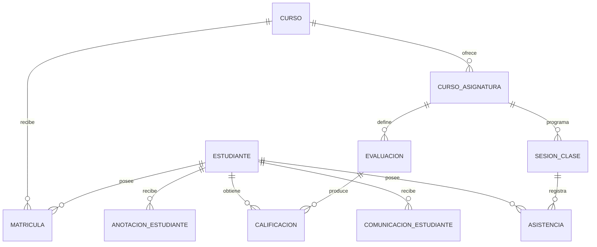

# Modelo funcional del estudiante

Estado: incremento funcional implementado con datos sintéticos.

Historia: PB-039. Esquema físico: `0.5.0`.

## Objetivo y alcance

Entregar a cada estudiante un portal personal de solo lectura para consultar su
matrícula vigente, asignaturas, calificaciones publicadas, asistencia, calendario,
anotaciones visibles y mensajes de acompañamiento.

## Regla de autorización

La identidad autenticada delimita toda consulta:

```text
Rol estudiante + estudiante_id de sesión = estudiante_id solicitado
```

Una diferencia produce `403`. La respuesta estudiantil excluye alertas internas,
reglas, evidencia de riesgo, datos de compañeros y controles docentes.

## Modelo de publicación



La migración `005_student_portal.sql` agrega control de visibilidad y fecha de
publicación a evaluaciones, notas y anotaciones, además de
`comunicacion_estudiante` para mensajes trazables.

## Vistas implementadas

- `Mi inicio`: indicadores, últimas notas, próximos eventos y acompañamiento.
- `Mis asignaturas`: profesor, horario, sala, asistencia y notas publicadas.
- `Mi asistencia`: resumen, historial reciente y porcentaje por asignatura.
- `Calendario`: evaluaciones, entregas y presentaciones publicadas para el curso.
- `Mis anotaciones`: únicamente registros positivos o por mejorar visibles.

## API de demostración

`GET /api/student/workspace/:id` exige `x-demo-role: student` y que
`x-demo-student-id` coincida con `:id`. El encabezado simula la identidad de una
sesión; debe reemplazarse por una sesión firmada en PB-011/PB-012.

## Límite conocido

El portal es funcional para consulta, pero consume datos sintéticos en memoria.
El esquema PostgreSQL está listo para la persistencia; conectar repositorios y
autenticación productiva corresponde a los incrementos siguientes.
